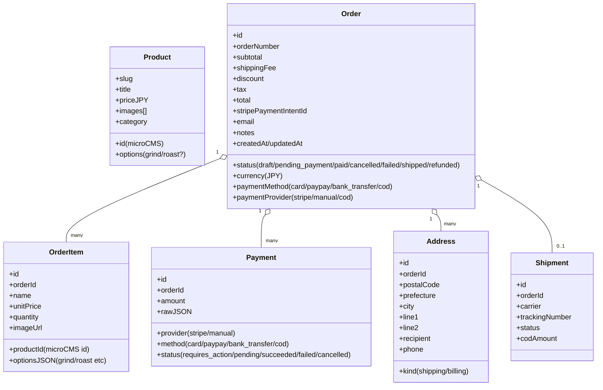

# 街と珈琲 EC アーキテクチャ設計（MVP）

本ドキュメントは「街と珈琲」のECサイトを最小構成で立ち上げ、将来的な拡張も見据えた全体設計を示します。まずは商品閲覧〜決済までを滑らかにし、運用負荷を抑えつつ拡張余地を確保します。

---

## 1. 目的・前提・非機能要件

- 目的: 最小構成で最大効果。ECの基本体験（一覧/詳細/カート/チェックアウト）を短期で公開。
- 前提: 在庫管理は不要（受注後焙煎）。商品情報は microCMS 管理。
- 支払い: クレカ（Stripe）＋ 銀行振込 ＋ PayPay（可能なら代引き）。
- 非機能:
  - パフォーマンス: 主要ページは静的生成/ISR、画像最適化、軽量JS。
  - セキュリティ: 決済はサーバ側で金額検証、Webhook 検証、秘密情報は環境変数。
  - 運用性: microCMS で商品運用、注文はDBで一元管理、Stripe で入金自動化を優先。
  - 可用性/拡張性: Vercel/Serverless を前提。段階的に機能追加可能な分割設計。

---

## 2. 全体アーキテクチャ

```mermaid
flowchart LR
  U[ユーザー/ブラウザ] -->|RSC/CSR| N[Next.js(App Router)]
  N <-->|ISR/Fetch| M[microCMS]
  N -->|Route Handlers/Server Actions| DB[(DB: Postgres/SQLite)]
  N -->|Stripe SDK| S[Stripe]
  S -->|Webhook| N
  N -->|メール送信| EM[Mail(Resend/SendGrid)]
```

- Next.js は App Router + RSC で実装。商品一覧/詳細はISRで高速配信。
- 商品データは microCMS。注文・支払・顧客情報はアプリDBに保存。
- 決済は Stripe を中心に実装。Webhookで入金確定し、注文状態を更新。
- 銀行振込/PayPay は Stripe による自動化（可能な場合）を優先。難しい場合は一時的に手動運用を許容。

---

## 3. 技術スタック（MVP）

- フロント: Next.js 14+（App Router, TypeScript, React Server Components）
- UI/スタイル: Tailwind CSS（最小ユーティリティで素早く）
- 状態管理: Cart はクライアント側に保持（localStorage + Zustand）。金額計算は常にサーバ最終検証。
- CMS: microCMS（商品、カテゴリ、オプション）
- 決済: Stripe Payment Element（クレカ/PayPay/銀行振込が揃えば単一統合）。Webhookで注文反映。
- DB/ORM: Prisma + SQLite（開発）/ Postgres（本番: Vercel Postgres/Neonなど）
- メール: Resend or SendGrid（注文受付/入金確認）
- デプロイ: Vercel（ISR/Edge/Serverless）

---

## 4. ドメイン/データモデル

商品は microCMS 管理。注文はアプリDBで一元管理し、支払・配送・顧客と紐付けます。



- 最小セット: Order / OrderItem / Address（配送先）/ Payment
- 先送り: Shipment（出荷連携/COD処理が乗ったら追加活用）

---

## 5. コンテンツモデル（microCMS）

- product（固定）
  - id, title, slug, description（Rich Text/Markdown）, price_jpy（税込/税抜は要確認）
  - images（メイン＋サブ）, category（参照）, tags
  - options: roast_level, grind_type（豆/中挽きなど）, weight_g（200g など）
  - shipping_lead_days（焙煎〜発送目安）, is_active
- category
  - id, name, slug, description

変更頻度の高い「価格・在庫表示」はCMS、金額の最終確定はサーバ側計算（改ざん防止）で行います。

---

## 6. ページ/ルーティング

- 一覧: `/products`（ISR）
- 詳細: `/products/[slug]`（ISR）
- カート: `/cart`（CSR + localStorage）
- チェックアウト: `/checkout`（住所/配送/支払い選択）
- 完了: `/thank-you?order=...`
- プライバシー/特商法/返金ポリシー等: 静的ページ

API(Route Handlers):
- `POST /api/checkout/initialize` 合計再計算 + 注文下書き + 決済初期化（Stripe PaymentIntent）
- `POST /api/checkout/confirm` 決済確定後の注文確定（クライアント確認→サーバ最終確定）
- `POST /api/webhooks/stripe` Webhook で入金/失敗イベント受信→注文更新
- （手動振込の場合の補助）`POST /api/orders/:id/mark-paid`（管理者用）

---

## 7. チェックアウト設計（支払い別フロー）

共通方針: 金額はサーバで最終計算し PaymentIntent を作成。クライアントは clientSecret を用いて決済 UI を表示。Webhook で確定。

- クレカ（Stripe）/ PayPay（Stripe対応可の想定）
  1) `/api/checkout/initialize` にて Order(draft) 作成 + PaymentIntent 作成（allowed_payment_method に card/paypay）。
  2) フロントで Payment Element 表示→ confirm → `return_url` へ遷移。
  3) Webhook `payment_intent.succeeded` で Order を paid に更新、メール送信。

- 銀行振込
  - A) Stripe「JP bank transfer」を利用できる場合: PaymentIntent で振込先（仮想口座）を発行→画面とメールで案内→Webhook入金確定で自動照合。
  - B) 手動振込の場合: 注文確定時に入金案内（口座/期限/金額/注文番号）を表示・送信。入金確認後、管理者が paid に更新。

- 代引き（任意・後追い）
  - 注文時に COD 手数料を加算して確定。配送会社の代引きサービス運用に合わせ、発送時に別途処理（API連携 or 手動）。

---

## 8. セキュリティ/信頼性

- 金額改ざん対策: サーバでラインアイテム→小計→送料→税→合計を再計算し、クライアント値を信用しない。
- Webhook 検証: Stripe 署名検証を必須化。重複イベントは冪等処理。
- 入金と注文: 入金成功のみ paid。失敗/キャンセルは状態遷移を厳密化。
- 機密情報: `.env` 管理、公開側で露出禁止。権限境界は Route Handlers 内で検証。
- 監視: エラー監視（Sentry 等）、重要イベントの監査ログ化（最小でもWebhookログ）。

---

## 9. パフォーマンス/SEO/アクセシビリティ

- ISR: 一覧/詳細はISR（microCMS更新時の再検証）
- 画像: `next/image` + WebP、適切なサイズ
- SEO: メタ/OGP自動生成（商品名/価格/画像）
- A11y: フォーカス制御、フォームエラー表示、キーボード操作

---

## 10. 環境変数（想定）

- `MICROCMS_SERVICE_DOMAIN`, `MICROCMS_API_KEY`
- `STRIPE_SECRET_KEY`, `STRIPE_PUBLISHABLE_KEY`, `STRIPE_WEBHOOK_SECRET`
- `DATABASE_URL`（開発はSQLite、本番はPostgres）
- `NEXT_PUBLIC_SITE_URL`
- `MAIL_PROVIDER_API_KEY`（任意）

---

## 11. 開発フェーズ計画（提案）

- フェーズ1（MVP）
  - microCMS スキーマ定義 → 一覧/詳細（ISR）
  - カート（Zustand）→ チェックアウト（住所/配送/確認）
  - クレカ決済（Stripe Payment Element）
  - 注文/決済/住所のDB保存、Stripe Webhook連携、メール送信
  - 振込は暫定「手動案内」で先に公開

- フェーズ2
  - PayPay（Stripe 経由）追加
  - 銀行振込を Stripe JP bank transfer へ移行（自動消込）
  - 管理向けの簡易注文一覧/検索

- フェーズ3（任意）
  - 代引き対応（配送会社連携 or 手動運用整備）
  - クーポン/送料ロジック拡張、レポート、定期便 など

---

## 12. トレードオフ/リスク

- 複数決済手段: Stripe一元化で運用は軽いが、提供状況/手数料に依存。提供外の場合は手動運用が必要。
- 在庫なしモデル: 欠品は発生しないが、リードタイム/受注量ピーク時の案内・締切設計が重要。
- 手動運用部分: 早期公開の対価として、当初は手動確認が一部発生し得る（振込・代引き）。

---

## 13. 次アクション

- 未確定事項（支払い/税/送料など）を詰める（open-questions.md）。
- 決済方法の最終方針（StripeでのPayPay/銀行振込の有無）を決定。
- microCMS スキーマ草案の確定→実装開始。
- DBスキーマ初版（Prisma）とAPIルートの雛形作成。

